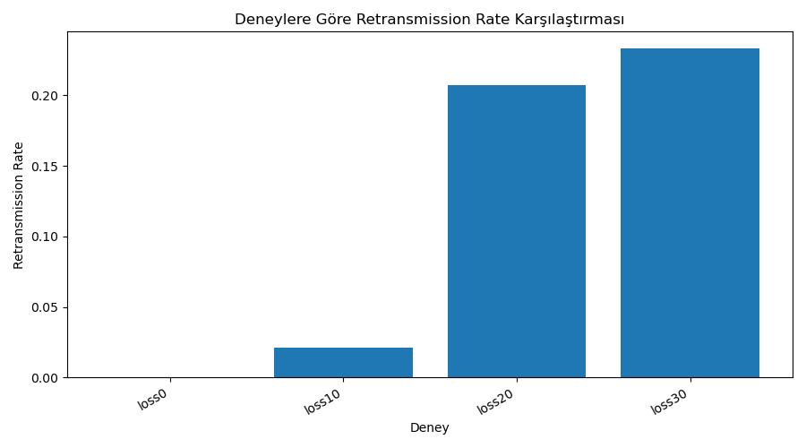
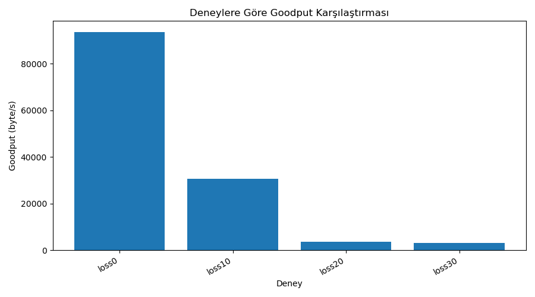
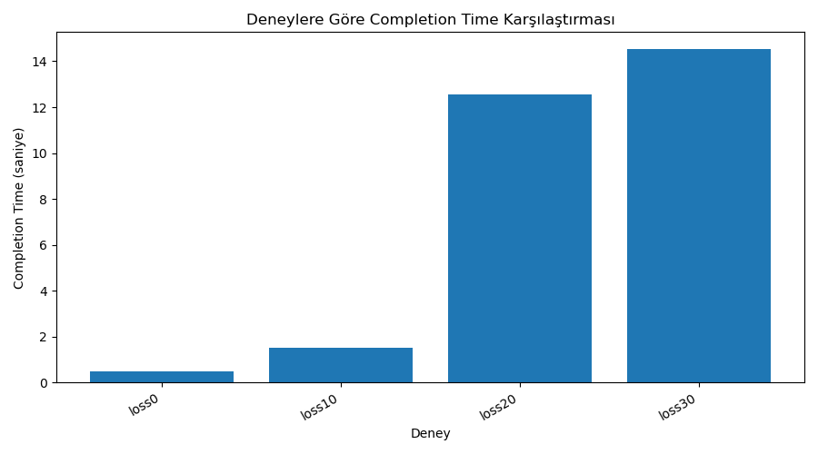
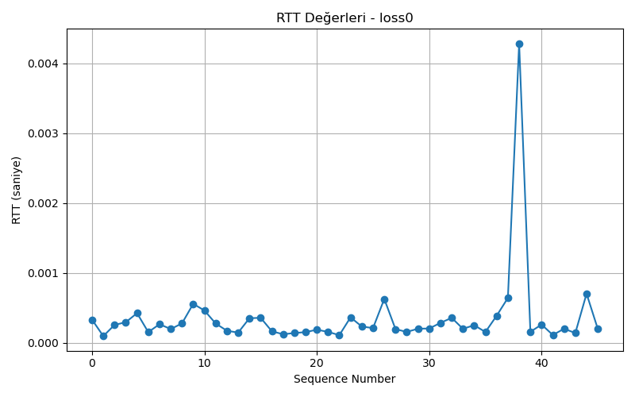
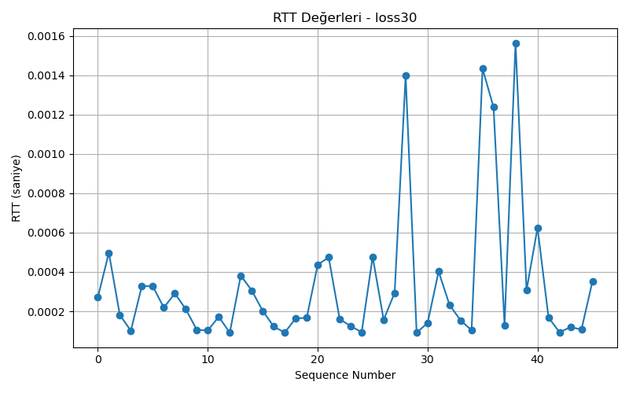
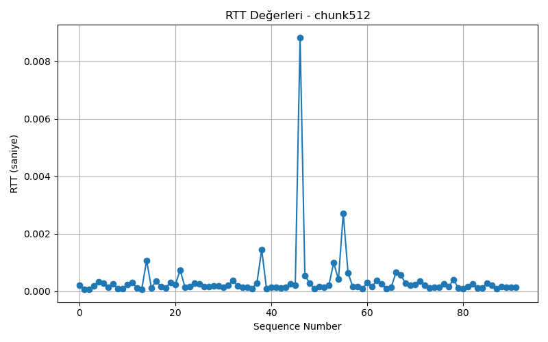
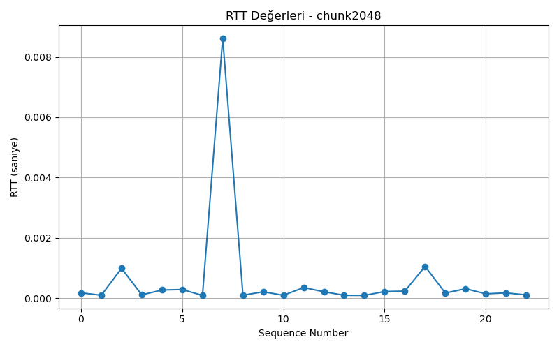

# NetProbe

Bilgisayar Ağları dersi kapsamında geliştirilen NetProbe, UDP protokolü üzerinde güvenilir dosya aktarımı gerçekleştiren ve ağ performansını analiz eden bir uygulamadır.

## Proje Hakkında

UDP protokolü doğası gereği paket teslim garantisi sağlamaz. Bu projede UDP üzerine uygulama katmanında;

- ACK (Acknowledgment)
- Sequence Number
- Timeout Kontrolü
- Retransmission
- SHA-256 Bütünlük Doğrulaması

mekanizmaları eklenerek güvenilir dosya aktarımı gerçekleştirilmiştir.

Aktarım sürecinde oluşan ağ davranışları kaydedilmiş, analiz edilmiş ve grafiklerle görselleştirilmiştir.

---

## Kullanılan Teknolojiler

- Python 3
- UDP Socket Programlama
- SHA-256
- Pandas
- Matplotlib
- Wireshark
- Kali Linux (VMware)
- Visual Studio Code

---

## Proje Yapısı

```text
NetProbe/
│
├── client.py
├── server.py
├── analysis.py
│
├── files/
│
├── logs/
│   ├── transfer_log.csv
│   ├── experiment_results.csv
│   └── experiment_summary.csv
│
└── graphs/
```

---

## Çalıştırma

### Sunucuyu Başlat

```bash
python3 server.py
```

### İstemciyi Başlat

```bash
python3 client.py
```

### Analizleri Oluştur

```bash
python3 analysis.py
```

---

# Performans Analizi

Proje kapsamında farklı ağ koşulları altında deneyler gerçekleştirilmiş ve sonuçlar grafiklerle analiz edilmiştir.

## Retransmission Rate Karşılaştırması

ACK kayıp oranı arttıkça yeniden gönderim ihtiyacının arttığı gözlemlenmiştir.



---

## Goodput Karşılaştırması

Kayıp oranı arttıkça başarılı şekilde iletilen faydalı veri miktarının azaldığı görülmektedir.



---

## Completion Time Karşılaştırması

Kayıp oranının yükselmesi dosya aktarım süresini artırmaktadır.



---

## RTT Analizi

Farklı ağ koşullarında ölçülen RTT değerleri aşağıdaki grafiklerde gösterilmiştir.

### %0 ACK Kaybı



### %30 ACK Kaybı



---

## Paket Boyutu Analizi

Farklı paket boyutlarının ağ performansı üzerindeki etkisi incelenmiştir.

### 512 Byte Paket



### 2048 Byte Paket



---

## Wireshark Analizi

Proje boyunca UDP trafiği Wireshark kullanılarak izlenmiştir.

İncelenen başlıca noktalar:

- UDP paket akışı
- ACK paketleri
- Paket boyutları
- Timeout sonrası yeniden gönderimler
- Flow Graph analizi
- I/O Graph analizi

Bu sayede uygulama seviyesinde geliştirilen güvenilirlik mekanizmalarının ağ üzerindeki etkileri doğrulanmıştır.

---

## Gerçekleştirilen Özellikler

✅ Güvenilir UDP Dosya Aktarımı

✅ ACK Mekanizması

✅ Timeout Kontrolü

✅ Retransmission

✅ SHA-256 Dosya Doğrulama

✅ RTT Hesaplama

✅ Throughput Hesaplama

✅ Goodput Hesaplama

✅ CSV Loglama

✅ Grafik Üretimi

✅ Wireshark Trafik Analizi

---

## Proje Ekibi

- Elif Nur Beycan
- Kübra Kaya
- Ceren Ebrar Yücetombullar

Bursa Teknik Üniversitesi  
Bilgisayar Mühendisliği Bölümü  
Bilgisayar Ağları Dönem Projesi - 2026
